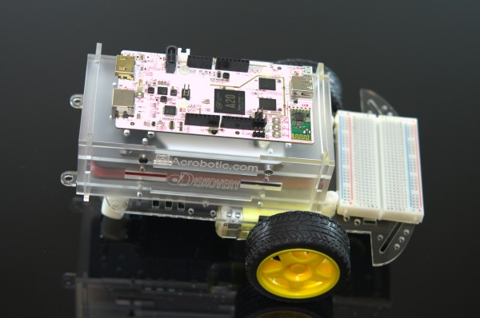

# Acrobotic pcDuino3 Kit Examples

## Demos

Sample project code and details are provided for the sensors and actuators included with the kit. See the demo specific documentation for more details. Specific instructions for each demo implementation (Arduino C, Python, Bash, etc...) are included in the source code.

## Resources

A pcDuino3 getting started guide, setup notes, and important specifications are documented on the [wiki](https://github.com/acrobotic/Ai_pcDuino_Examples/wiki).

SolidWorks 2012 edition models and drawings and available as well.

Office hours will be held on Saturdays during the Pasadena Arduino meetup: www.meetup.com/Arduino-Electronics-DIY-Robotics-Pasadena/

## Feedback

You are encouraged to use the ticket system to suggest improvements, report errors, or ask questions.

## Supplies

The Kits were designed in collaboration with a local (Pasadena) [Interactive Electronics & Fabrication company](http://acrobotic.com).  Additional electronic supplies are available on their website, including an option for same-day pick-up using the discount code MEETUPFS00.

